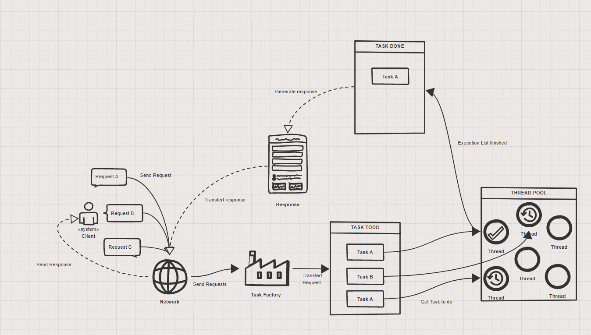
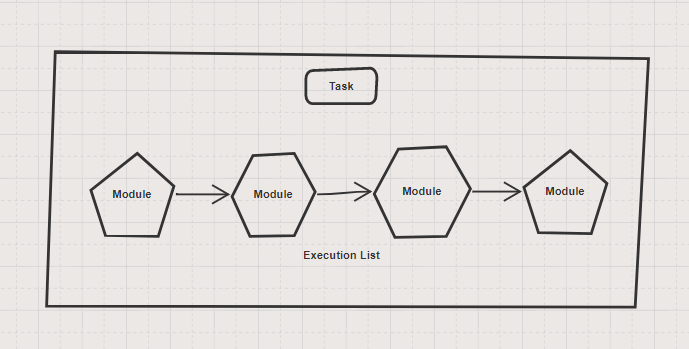

# ExistenZIA
The API that will change your existence !

 

## The idea
When designing an API, some may want to go for **freedom** and let people as free as possible regarding the implementation. The other way is to provide a more **structured** API with abstract classes and even methods that are **already** implemented for you.

At _ExistenZia_ we went the **second** way. 

We think **too much** freedom is actually putting the hassle of carefully threading a well designed interface on the developers. We think that establishing some mechanisms **ourselves** and structuring a bit more the API actually allow the developers, **you**, to **concentrate** on the most important part: the [Modules].

It also **reduces** the **variety** of bugs that may appears and help to build a more **robust** API by driving the community toward a **shared** logic.

## The actual thing

Nothing better than a cool schema to describe our HTTP server :

And a [Task] is roughly a module process line :

## Content Table
* [Configuration]
* [Modules]
* [Task]
* [Multi-Threading]
* [Core]
* [Examples]

## Top Features
#### [Open Configuration](Configuration)
Even though we think that too much freedom isn't ideal, we let the user configure its project the way he wants. 

We provide **simple** [interfaces](Configuration) and some [examples](Examples) to show how we would do it, but you can use the method that best suits **you**. 

#### [Shared Modules](Modules)
Having modules that process requests is **good**, but being able to call any module from within another one is even **greater** ! 

With our [shared modules](Modules) you can create a logger that will be thread safe and callable from any **basic** module ! 
  
#### [Multi-threading]
ExistenZia provides to the developer a thread pool were workers are waiting for [Tasks](Task) to process. Thus allowing better overall performance and let the main thread open to other duties (ie: user input).

#### [Examples], Documentation and Reactivity
We provides you [Examples] of basic implementation of most features and will continue to add more. 

We will be available and active on this github most of the time and will provide wisely pondered answers to questions and pull requests.

## Our Word

We poured a lot of time, effort and sweat into this API (the commit and pull request historic **may** convince you) and we will thank **gratefully** any developer who pick ExistenZia as their favorite API !

[Modules]: https://github.com/PierreBougon/ExistenZIA/tree/master/API/include/modules
[Configuration]: https://github.com/PierreBougon/ExistenZIA/tree/master/API/include/loader
[Examples]: https://github.com/PierreBougon/ExistenZIA/tree/master/Examples
[Task]: https://github.com/PierreBougon/ExistenZIA/tree/master/API/include/task
[Multi-Threading]: https://github.com/PierreBougon/ExistenZIA/tree/master/API/include/thread
[Core]: https://github.com/PierreBougon/ExistenZIA/tree/master/API/include/core
